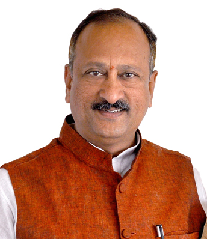

<!DOCTYPE html>
<html>
    <head>
        <title>
            KCEA
        </title>
    </head>
    <body>
        <h1 title="a place of values">KSHATRIYA COLLEGE OF ENGINEERING</h1>
        

       <h2><a href="./home.html" title="click here to go to home page">HOME</a> <a href="./about.html" title="click here to go to about page"  target="_blank">ABOUT</a> <a href="./gallery.html" title="click here to go to gallery"  target="_blank">GALLERY</a></h2> 
       <h2>WELCOME TO KSHATRIYA</h2>
       
       
       <h4>Kshatriya College of Engineering (KCEA) was established in the year 2001 under the aegis of Pandit Deendayal Upadyay Educational Society. KCEA is located on a sprawling 40 acres campus. It is located on the serene NH-16 highway, 30 km away from nizamabad district. KCEA is affiliated to the Jawaharlal Nehru Technology University Hyderabad.(JNTUH) offering graduate programs in engineering and postgraduate programs in the streams of Engineering, Business Administration, and Polytechnic.To be the center of excellence in technical education and research”. The Practices and the Culture at the Institute has always been to provide Quality Education by enhancing the overall Educational experience of Students adopting a wide range of Academic, Practical, Co-Curricular, Extra-Curricular Programs in the State-of-the-Art Facilities, Services and Activities to enable the required exposure to a variety of Social, Cultural, Intellectual, Recreational Opportunities and Challenges. Such learning experiences have enriched the lives of Students and helped them to develop into a Multi-Skilled and Multi -Tasking Personalities that ensured success in their Careers and Occupations. Co-curricular and Extra-Curricular activities are planned and executed through a number of Associations, Clubs, Societies, Students’ Chapters of Professional Bodies, with a view to allow the Students, the necessary freedom to plan and execute every effort and in the process nurture them to be the future Leaders who learn to address Challenges and carve a path of Success.</h4>
       
click <a href="https://kcea.in/"><b>here</b></a> for more details

       <h2>Words from Chairman</h2>
       
       <h3>Aljapur Srinivas Garu</h3>
       
I take great pleasure for being the chairman of this institution. I have a strong desire to uplift the standard of living of the people belonging to the rural area. Kshatriya College of Engineering (KCEA) has evolved out of that desire. With clear goal, KCEA is leaping forward to the next decade. We have overcome a lot of obvious hurdles which most of the rural engineering colleges in the state are still facing. I am proud to say that KCEA was successful in attracting and retaining the faculty from IIT background. Senior staff from reputed organizations such as DRDO are rendering their services to the institution. KCEA believes in holistic development of the student. Our country requires youth with sound technical skills, strong leadership skills and sensible towards human ethics. To ensure the creation of energetic youth, a lot of initiatives have been taken; a few of them were establishment of research & development cell in collaboration with Microsoft corporation, NCC & NSS units for boys and girls and the digital class rooms with modern infrastructure. We have an immediate challenge to achieve total quality management of the institution and total quality of individual i.e., both faculty and students. One of the ways to achieve total quality is through NBA accreditation. It will not be a difficult task for us to get NBA accreditation, as our institution is already an ISO 9001:2008 certified. However, with a little extra effort from all the stakeholders of the institution we can easily acquire the accreditation. Greater expectations and bigger goals are ahead of us. Enriched by our experience let us all embrace our responsibilities with enthusiasm, commitment and loyalty. Students are advised to be careful at all the times, adhere to safety norms and be focused on the academics. All the best.

       <h2>Campus Life</h2>
       
Dedicated faculty offer students an innovative and stimulating learning experience both inside the classroom and laboratory environment and within their community.Professional and support staff offers students every opportunity to succeed in their studies and extracurricular activities with specialized services tailored to their individual needs.Superior facilities are available to students, faculty and staff, from air-conditioned smart classrooms and labs to business innovation to sports installations and to good food service in cafeteria.Big placements greet our students with ample opportunities with around 62 core and software companies visiting the institute every year and successful in placing 91% of eligible students. 17% of the students are going overseas for higher studies.

       <h2>Placement and training</h2>
       
Lorem ipsum dolor, sit amet consectetur adipisicing elit. Molestiae non eius quod, quas enim iste qui officiis error nemo, ex blanditiis quaerat. Alias, consequatur natus maiores, veniam rem a iste voluptatem perferendis velit fugiat, ratione suscipit iusto qui quidem minus sapiente laborum fuga. Omnis, adipisci. Modi ex mollitia quia quidem fuga quod magni doloribus natus quisquam, obcaecati voluptatibus autem at impedit possimus rem voluptatum veniam dignissimos eligendi debitis nulla fugiat molestias accusamus. Molestiae consectetur porro quo ipsum obcaecati placeat dolores facere odit veritatis iure, facilis magnam eius exercitationem expedita ratione nesciunt, quas similique. Obcaecati nisi blanditiis rerum officiis laboriosam sapiente fuga autem laudantium porro quaerat debitis excepturi assumenda distinctio fugit sed amet sit nesciunt, vero, accusamus animi? Repellat distinctio asperiores reprehenderit expedita iusto. Quam cum voluptatibus doloremque voluptatum maxime illum non voluptatem aspernatur, blanditiis nihil suscipit tempora placeat accusantium fuga odio labore quasi ad mollitia vero? Libero, possimus pariatur? Eveniet at harum sed! Veniam voluptates incidunt reprehenderit ea iste corporis atque velit tempora, dolorem cumque non perspiciatis, ipsum quisquam laboriosam explicabo qui eligendi id fugiat dolore et nemo! Asperiores iste velit veniam dolorem dolores qui eligendi aliquam a ut rerum expedita, sunt libero facilis cum? Quidem perspiciatis amet exercitationem reprehenderit sunt voluptates itaque vel sed, alias eius. Sunt, quidem omnis voluptas velit sint provident dolor voluptatum deserunt minus aperiam at culpa eligendi inventore deleniti! Eius, dignissimos repudiandae incidunt consequuntur tempora possimus! Exercitationem obcaecati ad, dolorem dolores minima, hic perspiciatis dicta blanditiis harum odio porro sit debitis, voluptatum quam expedita? Laudantium doloribus iste perspiciatis dignissimos voluptas quia similique saepe explicabo accusamus aperiam officiis corporis minus eos culpa, accusantium expedita eaque odio, sequi illum vero! Quam id corrupti minus quo magni, alias voluptates repudiandae sequi minima vitae repellendus laudantium dignissimos, harum praesentium error modi facere dolorem corporis esse doloremque, nostrum natus similique.

       <h2>Departments</h2>
       
The results of the R&D division and own development themes of technical departments are developed by the relevant technical departments of Manufacturing division and business divisions for existing businesses, and by each development center and New projects development division under Technology Center, for new businesses. Through research and development processes, Engineering division is responsible for developing new facility technologies.echnical departments develop elemental technologies and processes for commercialization of the results of R&D, and scale up processes using pilot plant and production facilities. The departments collaborate with business divisions to provide product information hearing and technical support to customers, and they promote product design against market needs.

       
<b><a href="https://kcea.in/departments/ece_department/about_cse">1.Electronics and communication Engineering </a></b> 
    <b><a href="https://kcea.in/departments/cse_department/about_cset">2.Computer science and Engineering </a></b> 
<b><a href="https://kcea.in/departments/eee_department">3.Electrical and Electronics Engineering </a></b> 
<b><a href="https://kcea.in/departments/civil_department">4.Civil Engineering </a></b> 
<b><a href="https://kcea.in/departments/mec_department">5.Mechanical Engineering </a></b>

       

       <h2>Reviews from students</h2>
       <h3>1.Narsimha</h3>
       
       
<b>Placements:</b> My GPA is 70%. The minimum package from our college is 5.0 LAP and around 15-20 LAP. Companies were from several cities, like Hyderabad, Bangalore, Chennai, et cetera, companies like Wipro, TCS, Infosys, et cetera. Our college students have at least a GPA of 75% to 85%. In our college, they offered me many types of chances to perform, to study, and to participate in many activities. 

        <b>Infrastructure:</b> Our college has two blocks for diploma and engineering. The class was very good, and college management was outstanding in teaching students. In our college, they conducted many labs from the 1st year to the final year. Even though we had a library to prepare for exams, their books helped us in our  
        
       <b> Faculty:</b> Our college has around 60–70 faculty with extremes in their subjects. Even though there were separate faculty for labs, games, subjects, and many other things. In our college, while running exams, they have allocated maximum security for exams, but there is no chance of cheating in our college. 
        
        <b>Other:</b> In our college, where we have been for 3 years, they have given us many opportunities, like SA WRITING, QUIZ, YEARLY MOMENTO, etc., and many more.

        <h3>2.Akshaya</h3>
        
        
<b>Placements:</b> My GPA is 58%. The minimum package from our college is 5.0 LAP and around 15-20 LAP. Companies were from several cities, like Hyderabad, Bangalore, Chennai, et cetera, companies like Wipro, TCS, Infosys, et cetera. Our college students have at least a GPA of 75% to 85%. In our college, they offered me many types of chances to perform, to study, and to participate in many activities. 

            <b>Infrastructure:</b> Our college has two blocks for diploma and engineering. The class was very good, and college management was outstanding in teaching students. In our college, they conducted many labs from the 1st year to the final year. Even though we had a library to prepare for exams, their books helped us in our  
            
           <b> Faculty:</b> Our college has around 60–70 faculty with extremes in their subjects. Even though there were separate faculty for labs, games, subjects, and many other things. In our college, while running exams, they have allocated maximum security for exams, but there is no chance of cheating in our college. 
            
            <b>Other:</b> In our college, where we have been for 3 years, they have given us many opportunities, like SA WRITING, QUIZ, YEARLY MOMENTO, etc., and many more.

    </body>
</html>
